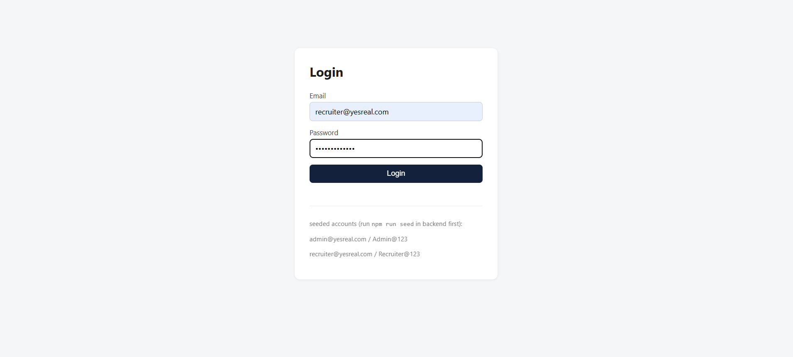
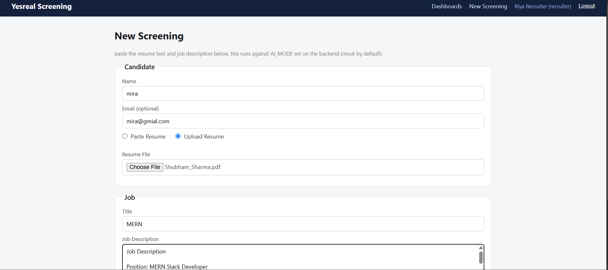
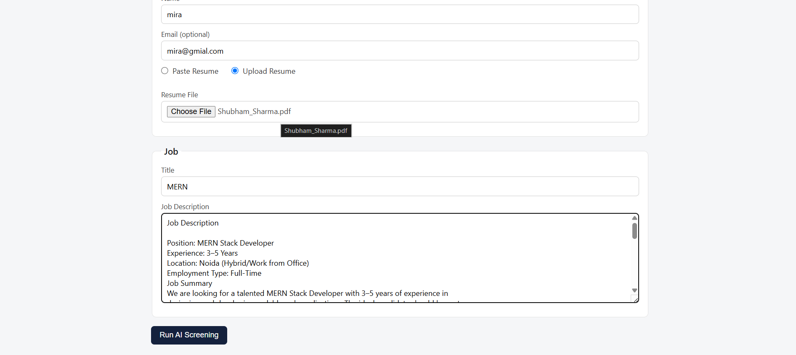
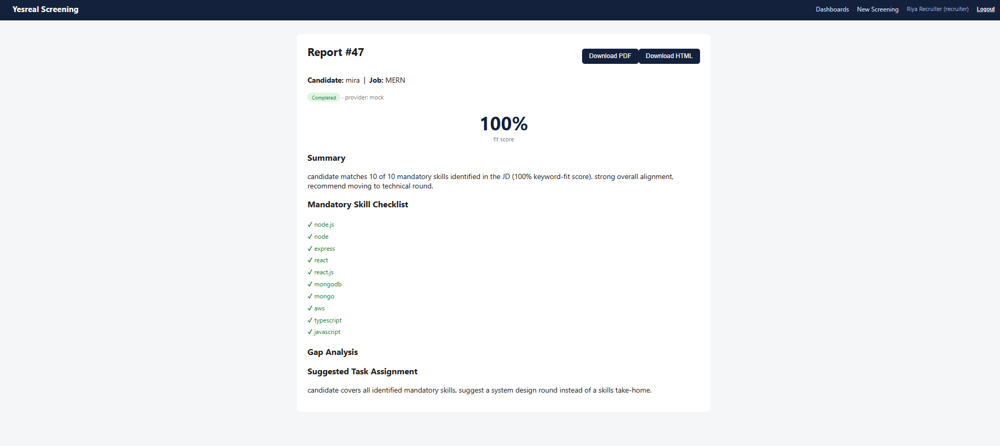
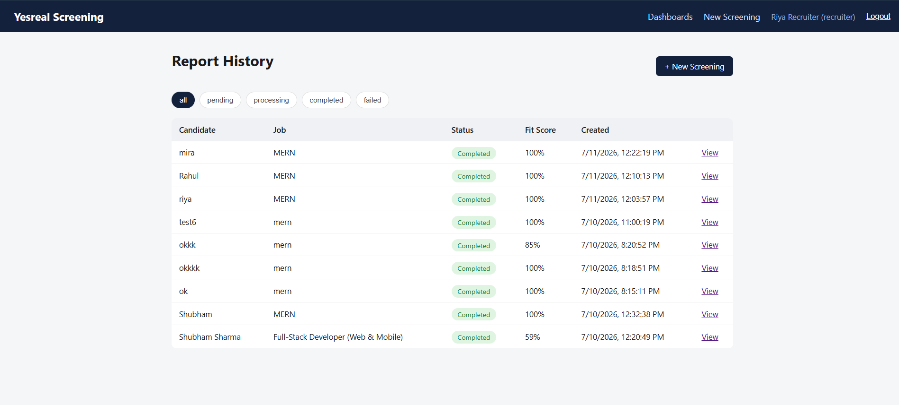
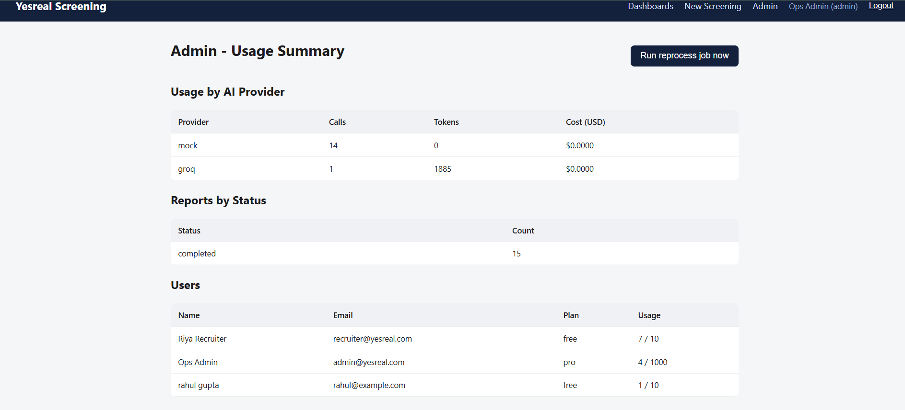

# Yesreal Technologies - Document Automation & AI Screening Module

Candidate assignment submission by **Shubham Sharma** for the Full-Stack
Developer (Web & Mobile) role.

A SaaS-style module that takes a resume and a job description, runs an
AI screening pass, and produces a recruiter-facing report: fit score,
mandatory-skill checklist, gap analysis, and a suggested next step
(interview task, technical round, etc). Reports export as PDF or HTML,
have a status lifecycle (`pending → processing → completed/failed`),
and get automatically retried by a daily cron job if generation fails.

## Stack

- **Backend:** Node.js + Express, PostgreSQL (raw SQL migrations, no ORM)
- **Frontend:** React + Vite
- **AI:** OpenAI or Groq, with a deterministic mock provider as the default
  (see "AI mode" below - this is intentional)
- **File storage:** local disk behind an S3-shaped abstraction
  (`services/storageService.js`) - swap one env var to point at real S3
- **PDF generation:** PDFKit
- **Cron:** node-cron
- **Auth:** JWT, two roles (`recruiter`, `admin`)

## Repository structure

```
/backend            Express API, migrations, seed script, jest tests
/frontend           React (Vite) dashboard
/docs               architecture note, sample report, screenshots
/postman            Postman collection covering every endpoint
docker-compose.yml  postgres + backend + frontend
```

## Quick start

```bash
docker compose up --build
# in another terminal, once postgres is healthy:
docker compose exec backend npm run migrate
docker compose exec backend npm run seed
```

Frontend: http://localhost:4173
Backend health check: http://localhost:5000/health

Seeded logins:
- `admin@yesreal.com` / `Admin@123`
- `recruiter@yesreal.com` / `Recruiter@123`

## Screenshots

### Login



### New Screening




### AI Screening Report



### Dashboard



### Admin Dashboard



## AI mode - mock by default, real providers are a one-line swap

`AI_MODE` in `backend/.env` controls this:

- `mock` (default) - deterministic keyword-based screening, zero cost,
  zero external calls. This is what the seed script, the cron job, and
  the automated tests all run on, which is why report generation is
  repeatable without needing an API key.
- `openai` - set `OPENAI_API_KEY`, calls OpenAI chat completions
- `groq` - set `GROQ_API_KEY`, calls Groq's OpenAI-compatible endpoint

All three return the exact same JSON shape, so nothing downstream cares
which one ran. See `docs/architecture.md` for why this was built this
way and exactly where the real API calls are wired in
(`backend/src/services/aiService.js`).

No key is ever committed - `.env` is gitignored, only `.env.example`
ships in this repo.

## RBAC

Two roles: `recruiter` (default on signup) and `admin` (seeded).
Recruiters only see the candidates/jobs/reports they created. Admins
see everything and get two extra endpoints:

- `GET /api/admin/usage-summary` - AI usage/cost by provider, report
  counts by status, per-user usage against plan limits
- `POST /api/admin/reprocess-now` - manually triggers the same job the
  cron runs on a schedule, useful for demoing it without waiting

## Testing

```bash
cd backend
npm install
npm test
```

15 tests across 3 suites, all mocking the database so they run without
a live Postgres instance:
- `tests/aiService.test.js` - the mock AI provider's screening logic
- `tests/auth.middleware.test.js` - JWT verification + RBAC role gating
- `tests/report.route.test.js` - the report creation route, including
  the usage-limit rejection path

## API collection

Import `postman/yesreal-collection.json`. Set the `base_url` and
`token` collection variables after hitting the login request.

## Sample output

`docs/sample-report.pdf` and `docs/sample-report.html` are real output
from `reportService.js` (generated by actually running the code, not
hand-written), so what you see there is exactly what the export
endpoints produce.
